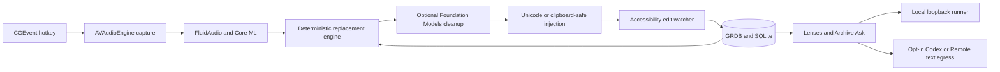

# Vaakya

[](https://github.com/dihelium/vaakya/actions/workflows/ci.yml)
[](https://www.swift.org/)
[](https://www.apple.com/macos/)
[](LICENSE)

Vaakya is a private, personalized voice workspace for Apple Silicon Macs. Hold Left Option to dictate into any app, or start meeting notes to capture your microphone and Mac audio. Recordings run through local Parakeet ASR with speaker diarization and produce **lens** drafts such as interview notes, decisions, and actions, with optional opt-in cloud APIs. Vaakya learns names and vocabulary from approved corrections and writing samples.

This is a public preview built as a production-minded native macOS project: a pure tested core, explicit privacy boundaries, local SQLite persistence, permission-aware AppKit integration, and reproducible packaging for both no-cost community and notarized releases.

## Highlights

- Local Parakeet speech recognition through FluidAudio
- Local meeting capture with microphone and system audio through ScreenCaptureKit
- Hold-to-talk and double-tap latch modes (menu-bar dictation)
- Text injection into the active app
- Imported-file transcription with offline speaker diarization
- **Lenses** — re-runnable insight templates (interview notes, self-debrief, decisions, actions) on a completed transcript
- Optional cloud lens API (text only; audio never uploaded; off by default)
- A correction engine that preserves case, punctuation, and phrase boundaries
- Suggested rules that stay pending until you approve them
- Local history, dictionary, and JSON export
- Optional cleanup with Apple Foundation Models on macOS 26+

## Requirements

- Apple Silicon Mac
- macOS 14 or later
- About 450 MB for the one-time speech model download
- Microphone, Screen and System Audio Recording, Accessibility, and Input Monitoring permissions

## Fast install

### GitHub release without an Apple Developer account

Download the DMG from the [latest GitHub release](https://github.com/dihelium/vaakya/releases/latest), open it, and drag Vaakya to Applications.

The community build is ad-hoc signed and is **not notarized by Apple**. On first launch, macOS will block it because it cannot verify the developer:

1. Try to open Vaakya once and dismiss the warning.
2. Open **System Settings → Privacy & Security**.
3. Scroll to Security, click **Open Anyway**, then confirm **Open**.

This is [Apple's documented override](https://support.apple.com/en-au/guide/mac-help/-mh40616/mac) and creates an exception for that copy of Vaakya. A managed work Mac may hide or disable **Open Anyway**. If so, use the source install below or ask your administrator. You may also need to grant permissions again after an update because an ad-hoc signature has no stable Developer ID identity.

The release includes SHA-256 checksums. Verification is optional but recommended:

```bash
shasum -a 256 -c Vaakya-0.2.0-SHA256SUMS.txt
```

### From source

You need an Apple Silicon Mac running macOS 14 or later and Xcode Command Line Tools. This single command clones, builds, installs to `~/Applications/Vaakya.app`, and opens the app:

```bash
git clone https://github.com/dihelium/vaakya.git && cd vaakya && make install
```

`make install` keeps SwiftPM's sandbox enabled, uses an ad-hoc app signature, and does not inspect signing identities in your Keychain. It never writes to `/Applications`. If it replaces an earlier user install, it keeps a timestamped backup beside the app.

On first launch, grant Microphone, Accessibility, and Input Monitoring. Grant Screen and System Audio Recording only if you use meeting notes. Then approve the one-time speech model download. FluidAudio handles the download from Hugging Face and later launches use the cached model.

If Xcode Command Line Tools are missing, run `xcode-select --install` once, finish Apple's installer, and repeat the command above.

## Use

1. Hold Left Option by itself.
2. Speak.
3. Release Left Option.
4. Vaakya transcribes locally and types at the cursor.

The menu bar shows recording and transcription state. Double-tap Left Option to latch recording, then press it once to stop.

The pending-suggestions badge is independent of Stage 2. Stage 2 cleans punctuation and casing. Suggestions are possible replacement rules learned from edits, and they remain pending until approved or rejected in Dictionary.

### Meeting notes

1. Open Vaakya and choose **start meeting notes**.
2. Grant Microphone and Screen & System Audio Recording access. macOS may ask you to reopen Vaakya after the first Screen Recording grant.
3. Keep your call in its normal app. Vaakya listens to your microphone and Mac audio without joining the meeting.
4. Choose **stop and make notes**. Vaakya creates a local recording job, then runs transcription and speaker diarization after the meeting stops.

There are no live partials and no meeting bot. The recording stays under Vaakya's Application Support directory and audio is never uploaded.

### Transcripts and lenses

1. Menu bar → **Transcribe Audio…** (or **Transcripts**) and import an `.m4a` / `.wav` / etc.
2. Wait until the job is **completed** (local Parakeet + diarization).
3. Open the job: rename speakers, edit **Notes** and **Context**.
4. In **Settings → Lenses (AI runners)**, keep the default **Local** runner or choose **Codex** or **Remote**. Enable **AI text egress** only for Codex or Remote.
5. Run a lens (e.g. Technical interview notes). Confirm when prompted for B1 runners.
6. Review the draft; **Mark reviewed** / **Mark final** when you trust it.

### Archive Ask

From the home screen, choose **ask archive**. Ask natural-language questions over completed recordings (decisions, who said what, what is still open). Answers are **drafts** grounded in a budgeted pack of notes + transcript turns with validated `[S#]` citations.

- **Local** runner may search the whole archive (loopback only).
- **Codex / Remote** require you to **pin** recordings (`+ add`) and confirm text egress.

**Retrieval roadmap:** v1 uses keyword + recency packing (no vector index). Next: chunk transcripts + SQLite FTS5 (see Engineering Atlas ADR-0002 patterns). Later: optional local embeddings / hybrid rank.

The Dock shows **Vaakya** as a normal app. The menu-bar icon still provides hotkey status and quick actions.

Raw transcript copy (L0) is always local. Other lenses require a configured AI runner (Local, or Codex/Remote with opt-in).

### Safe Codex setup on a work Mac

Use a company-approved Codex installation and sign in with the work account your employer permits. Vaakya does not bundle a Codex account, credentials, configuration, skills, plugins, or session history.

For each Codex run, Vaakya shows which recordings are included and asks for confirmation. It sends transcript text, notes, context, and the question over stdin. Audio and audio paths are not included. The subprocess is ephemeral and ignores user config and rules. Shell tools, project instructions, agents, web search, history, memories, analytics, and startup update checks are disabled for that run. The command sandbox is read-only.

Codex is still a cloud text-egress path. Your organization's Codex retention and workspace policies still apply. Use Local if transcript text must stay on the Mac.

## Build from source

```bash
git clone https://github.com/dihelium/vaakya.git
cd vaakya
make test
make build
open build/Vaakya.app
```

`make build` produces an ad-hoc signed release build at `build/Vaakya.app`. It does not install the app, stop a running app, or use identities from the Keychain. Set `VAAKYA_CODESIGN_IDENTITY` explicitly only when preparing a controlled signed release.

Other useful commands:

```bash
make package  # build dist/Vaakya-<version>-macOS.zip and .dmg
make audit    # verify the bundle, entitlements, and privacy invariants
make community-release VERSION=0.2.0  # test and package without an Apple account
```

Maintainers should follow [RELEASING.md](RELEASING.md).

## Privacy

Core dictation runs on the Mac after the speech model is downloaded. Vaakya contains no analytics, accounts, telemetry, advertising, or automatic updater.

Optional Stage 2 uses Apple Foundation Models and is off by default. Apple may route that work through Private Cloud Compute. See [PRIVACY.md](PRIVACY.md) for the exact data and network behavior.

## Data locations

- `~/Library/Application Support/Vaakya/vaakya.db`
- `~/Library/Application Support/Vaakya/config.json`
- `~/Library/Application Support/Vaakya/transcription-jobs/`
- `~/Library/Application Support/FluidAudio/Models/`

Export the dictionary from Settings before moving to a new Mac.

For a clean work-laptop install, clone this repository and run `make install`. Do not copy `~/Library/Application Support/Vaakya/`, a personal dictionary export, Keychain entries, or `~/.codex/` from another Mac. Those locations can contain transcripts, recordings, learned names, API settings, and account state. A source clone or public release artifact contains none of them.

## Architecture

The package has a pure `VaakyaCore` library for learning and persistence, a SwiftUI/AppKit app, and an offline evaluation executable. The app target contains reviewed network clients for a loopback local runner and the opt-in HTTPS remote runner. Codex runs as a separately installed subprocess. FluidAudio owns the consent-gated model download.



### Engineering details

- `VaakyaCore` contains alignment, replacement, cleanup guards, persistence, export, and writing-sample seeding with no AppKit dependency.
- The test suite currently covers 113 cases across 14 suites, including the Codex execution safety contract, using Swift Testing.
- Modifier-only hotkeys are handled through `flagsChanged`, not key-down events.
- Passive learning arms only after injected text lands, then diffs once at the end of a bounded Accessibility window.
- Conflicting corrections remain suggestions until the user selects one.
- Paste fallback snapshots and restores every pasteboard item type.
- The no-cost community release is ad-hoc signed, audited, packaged, and checksummed without Apple credentials. The separate Developer ID path signs, notarizes, staples, and runs Gatekeeper checks when a maintainer explicitly supplies credentials.

## Project status

The repository includes hold-to-talk dictation, meeting capture, imported audio transcription, speaker diarization, transcript editing, lenses, Archive Ask, history, dictionary, and correction learning. GitHub hosts clearly labelled, ad-hoc-signed community builds. They require a one-time manual Gatekeeper override because they are not Developer ID signed or notarized.

Third-party software and model attribution is listed in [THIRD_PARTY_NOTICES.md](THIRD_PARTY_NOTICES.md).
