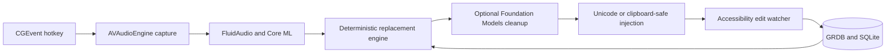

# Vaakya

[](https://github.com/dihelium/vaakya/actions/workflows/ci.yml)
[](https://www.swift.org/)
[](https://www.apple.com/macos/)
[](LICENSE)

Vaakya is a private, personalized dictation app for Apple Silicon Macs. Hold Left Option, speak, and release to type the transcript at the current cursor. Vaakya learns names and vocabulary from approved corrections and writing samples.

This is a public preview built as a production-minded native macOS project: a pure tested core, explicit privacy boundaries, local SQLite persistence, permission-aware AppKit integration, and a reproducible signing and notarization pipeline.

## Highlights

- Local Parakeet speech recognition through FluidAudio
- Hold-to-talk and double-tap latch modes
- Text injection into the active app
- A correction engine that preserves case, punctuation, and phrase boundaries
- Suggested rules that stay pending until you approve them
- Local history, dictionary, and JSON export
- Optional cleanup with Apple Foundation Models on macOS 26+

## Requirements

- Apple Silicon Mac
- macOS 14 or later
- About 450 MB for the one-time speech model download
- Microphone, Accessibility, and Input Monitoring permissions

## Install

Download the latest `.dmg` or `.zip` from [GitHub Releases](../../releases/latest).

For the DMG, open it and drag Vaakya into Applications. For the ZIP, unzip it and move `Vaakya.app` into Applications. Launch Vaakya, grant the three requested permissions, then approve the speech model download.

The first download is handled by FluidAudio from Hugging Face. Later launches load the cached model from disk.

## Use

1. Hold Left Option.
2. Speak.
3. Release Left Option.
4. Vaakya transcribes locally and types at the cursor.

The menu bar shows recording and transcription state. Double-tap Left Option to latch recording, then press it once to stop.

The pending-suggestions badge is independent of Stage 2. Stage 2 cleans punctuation and casing. Suggestions are possible replacement rules learned from edits, and they remain pending until approved or rejected in Dictionary.

## Build from source

```bash
git clone https://github.com/dihelium/vaakya.git
cd vaakya
make test
make build
open build/Vaakya.app
```

`make build` produces a release build. It uses a Developer ID identity when available, then a local development identity, and finally an ad-hoc signature. Only a Developer ID signed and notarized build is suitable for frictionless public distribution.

Other useful commands:

```bash
make package  # build dist/Vaakya-<version>-macOS.zip and .dmg
make audit    # verify the bundle, entitlements, and privacy invariants
```

Maintainers should follow [RELEASING.md](RELEASING.md).

## Privacy

Core dictation runs on the Mac after the speech model is downloaded. Vaakya contains no analytics, accounts, telemetry, advertising, or automatic updater.

Optional Stage 2 uses Apple Foundation Models and is off by default. Apple may route that work through Private Cloud Compute. See [PRIVACY.md](PRIVACY.md) for the exact data and network behavior.

## Data locations

- `~/Library/Application Support/Vaakya/vaakya.db`
- `~/Library/Application Support/Vaakya/config.json`
- `~/Library/Application Support/FluidAudio/Models/`

Export the dictionary from Settings before moving to a new Mac.

## Architecture

The package has a pure `VaakyaCore` library for learning and persistence, a SwiftUI/AppKit menu-bar app, and an offline evaluation executable. Runtime networking is not implemented in Vaakya source. FluidAudio owns the consent-gated model download.



### Engineering details

- `VaakyaCore` contains alignment, replacement, cleanup guards, persistence, export, and writing-sample seeding with no AppKit dependency.
- The test suite currently covers 82 cases across 8 suites using Swift Testing.
- Modifier-only hotkeys are handled through `flagsChanged`, not key-down events.
- Passive learning arms only after injected text lands, then diffs once at the end of a bounded Accessibility window.
- Conflicting corrections remain suggestions until the user selects one.
- Paste fallback snapshots and restores every pasteboard item type.
- Release scripts select Developer ID signing, preserve the microphone entitlement under hardened runtime, notarize, staple, package, checksum, and run Gatekeeper checks.

## Project status

The complete hold-to-talk, local transcription, text injection, model caching, history, dictionary, and correction-learning loop has been manually validated on Apple Silicon. The repository is ready for public source distribution. Public binary releases are intentionally withheld until they can be Developer ID signed and notarized.

Third-party software and model attribution is listed in [THIRD_PARTY_NOTICES.md](THIRD_PARTY_NOTICES.md).
