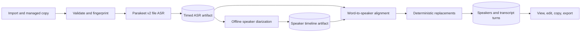

# Imported audio transcription and speaker diarization

Plan date: 2026-08-04
Status: implementation in progress
Target: Vaakya for macOS 14+ on Apple Silicon

## Implementation snapshot, 2026-08-04

- **Phase 0:** Not started. A representative interview audio file and hand-labeled excerpt are still needed for quality, memory, disk, and contention measurements.
- **Phase 1:** Substantially complete. Schema, CRUD, state types, speaker attribution, formatting, and idempotent turn replacement are tested. Full injected runner-failure coverage remains.
- **Phase 2:** Functional first pass. Managed copy, SHA-256, disk-backed Parakeet file ASR, progress, timing validation, and an atomic ASR artifact are wired. Temp-directory promotion, disk-capacity checks, manifest reconciliation, and a one-hour file gate remain.
- **Phase 3:** Functional first pass. Separate consent, offline diarization, atomic diarization artifact, speaker attribution, and turn persistence are wired. Fixed speaker count and real-audio quality validation remain.
- **Phase 4:** Usable first pass. The menu exposes `Transcribe Audio...`, and the workspace has queue/progress, pause/cancel/retry, transcript detail, raw ASR, copy, and plain/Markdown/JSON export. Speaker rename, turn editing, resume-after-cancel, and confirmed deletion remain.
- **Phase 5:** Not started beyond the unchanged 100-test regression suite and local bundle signing. Recovery, sleep/wake, privacy, long-file, concurrency, and documentation gates remain.

## 1. Outcome

Add a Transcripts workspace where the owner can import an existing audio file,
including an iPhone Voice Memos `.m4a`, and receive a local transcript grouped
by speaker. Processing may take as long as it needs, continues when the
Transcripts window is closed, and survives application restarts without losing
completed work.

The feature reuses Vaakya's current ASR exactly:

- FluidAudio 0.15.5
- Parakeet TDT 0.6B v2 Core ML
- int8 encoder precision
- 16 kHz mono input

Speaker diarization uses FluidAudio's offline Community-1/VBx pipeline. No
audio, transcript, or speaker embedding leaves the Mac. The only new network
event is the consent-gated, one-time diarization-model download owned by
FluidAudio.

This is imported-file transcription, not live meeting capture. The iPhone is
only an audio source. Vaakya remains a macOS app.

## 2. Locked decisions

1. **Keep the current ASR.** File transcription uses the same Parakeet v2 model
   and decoder configuration as live dictation. It does not introduce Whisper,
   Qwen, a cloud ASR, or a different Hinglish path.
2. **Use FluidAudio's file API.** `AsrManager.transcribe(URL, decoderState:)`
   already performs disk-backed conversion for long files, 15-second model
   windows, overlap merging, progress reporting, and token timestamps.
3. **Do not run Vaakya's current silence trimmer on imported files.** It
   concatenates voiced chunks and destroys the original timeline needed to
   align words with speakers.
4. **Use offline diarization.** `OfflineDiarizerManager` is the appropriate
   batch-quality path. Sortformer and LS-EEND are live or streaming alternatives
   and are not needed here.
5. **Copy the source into managed storage.** A private copy under Application
   Support makes restart recovery reliable even if the original Voice Memo is
   moved, unmounted, or deleted.
6. **Preserve raw evidence.** Store the raw ASR result and diarization timeline
   as immutable artifacts. Speaker-renamed, personalized, and user-edited text
   is derived data.
7. **No Stage 2 cleanup in the first release.** Foundation Models cleanup can
   change word count and meaning without maintaining timestamps. Deterministic
   replacement rules may be applied after speaker attribution. The raw ASR is
   always retained.
8. **Speaker identities are file-local.** Diarization initially yields labels
   such as `Speaker 1`, not real names. The user can rename them to `Me`,
   `Interviewer`, and so on. Cross-recording voice recognition is deferred.
9. **One batch job runs at a time.** Additional imports queue. This bounds Core
   ML and memory pressure and makes progress and recovery behavior predictable.
10. **Resumability is stage-granular.** Imported audio and every completed stage
    survive window closure, sleep, quit, crash, and relaunch. If the process
    stops inside a FluidAudio ASR or diarization call, that active stage restarts.
    FluidAudio 0.15.5 does not expose serializable in-flight decoder or VBx state.

## 3. User experience

### Import

- Add `Transcribe Audio...` and `Transcripts` to the menu-bar menu.
- Advertise only formats verified by tests. `.m4a`, `.wav`, `.caf`, and `.aiff`
  are the required initial set.
- Show the file name, duration, size, and an optional expected speaker count:
  `Auto`, `2`, `3`, or `4+`. `Auto` is the default.
- Before the first diarized import, explain the additional local model download
  and obtain separate persisted consent.

### Job list

Each job shows:

- file name and duration
- current stage and stage-specific progress
- queued, running, paused, completed, or failed state
- a useful error plus `Retry` when a stage fails
- `Pause`, `Resume`, and `Cancel Processing` controls

Cancelling processing never deletes the managed audio or completed artifacts.
Deleting a job is a separate, confirmed action that removes its database rows,
managed audio, and artifacts.

### Transcript detail

- Show timestamped speaker turns, not one giant text blob.
- Allow speaker renaming and turn-text editing.
- Keep an accessible raw-ASR view for quality diagnosis.
- Support copy-all plus Markdown, plain-text, and structured JSON export.
- Do not automatically teach the personal dictionary from long-transcript edits
  in the first release. That requires its own trust and noise policy.

Closing the Transcripts window does not stop work because Vaakya remains a
running menu-bar application. Quitting Vaakya stops the active task. Launching
it again reconciles the job and resumes from the last durable stage. Mac sleep
pauses normal execution, and work continues after wake while the process
remains alive.

## 4. Processing architecture



### Stage A: import and validation

1. Validate that `AVAudioFile` can open the source.
2. Read duration, channel count, sample rate, byte size, and available disk
   capacity.
3. Stream a SHA-256 fingerprint without loading the whole file into memory.
4. Copy to a temporary job directory, close it, then atomically rename the
   directory into place.
5. Insert the job row only after the managed copy is durable.

Disk-space validation must include the managed copy and FluidAudio's temporary
16 kHz Float32 conversion, approximately 230 MB per hour of mono audio, plus a
safety margin.

### Stage B: timed ASR

1. Load the selected `.v2` ASR models through the same model service used by
   live dictation.
2. Call the file-URL transcription API, not an app-owned whole-file `[Float]`
   conversion.
3. Consume `transcriptionProgressStream` for files longer than one model window.
4. Persist the full text, confidence, timing metadata, and token timings to an
   atomic `asr-result.json` artifact.

This stage must verify that token timestamps are present, monotonic, and within
the source duration. Missing timings are a job error because speaker attribution
would otherwise be fabricated.

### Stage C: offline diarization

1. Prepare `OfflineDiarizerManager` only after diarization-model consent.
2. Process the managed source URL through its memory-mapped file API.
3. Use the default Community-1/VBx settings with exclusive output segments.
4. Apply the optional exact speaker count when the user supplies one.
5. Persist a Vaakya-owned Codable representation of each speaker interval and
   quality score to `diarization-result.json`.

The currently cached legacy speaker models are not assumed sufficient. The
offline VBx path also requires its FBank, embedding, PLDA model, and PLDA
parameters. The implementation spike must measure and display the actual
additional download size instead of hard-coding an estimate.

### Stage D: word-to-speaker alignment

Create a pure `SpeakerAttribution` component in `VaakyaCore`:

1. Convert ASR token timings to word timings using FluidAudio's public timing
   conventions at the app boundary, then map them into VaakyaCore value types.
2. Assign each word to the speaker interval with the greatest temporal overlap.
3. If a word has no overlap, assign the nearest speaker only within a small,
   tested tolerance. Otherwise retain `Unknown Speaker`.
4. Break ties deterministically using overlap, segment quality, and stable
   speaker order.
5. Coalesce consecutive words for one speaker into turns while preserving
   punctuation and timestamps.
6. Assert that removing speaker labels from the derived turns preserves the ASR
   token sequence, except for normalized whitespace. Attribution must never drop
   or invent words.

Apply active deterministic replacement rules per completed turn and store both
`raw_text` and `final_text`. Replacement does not alter the turn's time range.

## 5. Durable state and recovery

### Files

Use:

```text
~/Library/Application Support/Vaakya/TranscriptionJobs/<job-id>/
  manifest.json
  source.<original-extension>
  asr-result.json
  diarization-result.json
```

`manifest.json` records the artifact schema, pipeline version, input hash,
source metadata, ASR model/version, FluidAudio version, and diarizer settings.
All artifact writes use `file.tmp` followed by an atomic replacement.

### Database migration

Add dedicated tables rather than overloading short `dictations` rows:

```sql
CREATE TABLE transcription_jobs(
  id TEXT PRIMARY KEY,
  source_name TEXT NOT NULL,
  managed_audio_path TEXT NOT NULL,
  source_sha256 TEXT NOT NULL,
  file_size_bytes INTEGER NOT NULL,
  duration_seconds REAL NOT NULL,
  expected_speaker_count INTEGER,
  status TEXT NOT NULL,
  active_stage TEXT NOT NULL,
  completed_stage TEXT NOT NULL,
  progress REAL NOT NULL DEFAULT 0,
  error_message TEXT,
  raw_text TEXT,
  final_text TEXT,
  created_at TEXT NOT NULL,
  updated_at TEXT NOT NULL
)

CREATE TABLE transcript_speakers(
  job_id TEXT NOT NULL REFERENCES transcription_jobs(id) ON DELETE CASCADE,
  speaker_key TEXT NOT NULL,
  display_name TEXT NOT NULL,
  sort_order INTEGER NOT NULL,
  PRIMARY KEY(job_id, speaker_key)
)

CREATE TABLE transcript_turns(
  id INTEGER PRIMARY KEY AUTOINCREMENT,
  job_id TEXT NOT NULL REFERENCES transcription_jobs(id) ON DELETE CASCADE,
  ordinal INTEGER NOT NULL,
  speaker_key TEXT NOT NULL,
  start_seconds REAL NOT NULL,
  end_seconds REAL NOT NULL,
  raw_text TEXT NOT NULL,
  final_text TEXT NOT NULL,
  confidence REAL,
  UNIQUE(job_id, ordinal),
  FOREIGN KEY(job_id, speaker_key)
    REFERENCES transcript_speakers(job_id, speaker_key) ON DELETE CASCADE
)
```

Store only a validated relative managed-audio path. Reject path traversal before
resolving it below the jobs directory.

### State machine

```text
queued -> preparingASR -> transcribing -> asrComplete
       -> preparingDiarizer -> diarizing -> diarizationComplete
       -> aligning -> complete
```

`paused`, `cancelled`, and `failed` retain both `active_stage` and
`completed_stage`, so retry knows where to restart.

Recovery rules:

1. At launch, convert stale transient states to queued recovery work.
2. Reconcile the database with valid atomic artifacts before choosing a stage.
3. An artifact counts only when its input hash, schema version, and pipeline
   version match the job manifest.
4. Write the artifact first, then advance `completed_stage` in one database
   transaction.
5. Replacing turns is transactional and idempotent, so retries cannot duplicate
   transcript rows.
6. A corrupt artifact becomes a job error. Never silently use partial JSON or
   overwrite the source audio.

## 6. Runtime ownership

- Add an `AudioTranscriptionJobRunner` actor owned by `AppEnvironment`.
- Resume queued jobs after database startup and model-consent checks.
- Hold a `ProcessInfo` user-initiated activity while a job runs, allowing normal
  system sleep but avoiding App Nap deprioritization during explicit work.
- Process only one imported file at a time.
- Use a separate batch `AsrManager` so its decoder state and progress stream are
  never shared with live dictation.
- Keep live hotkey dictation enabled. Phase 0 must benchmark concurrent Core ML
  contention. If live dictation exceeds its latency gate, add cooperative batch
  cancellation and restart, or require an explicit batch pause before dictation.
- Cancellation is cooperative through Swift `Task` cancellation. A stage that
  does not reach its atomic artifact is intentionally retried from its start.

## 7. Implementation phases

### Phase 0 - capability and quality spike

- Extend the local eval executable, not the app UI, to run one representative
  Voice Memos `.m4a` through Parakeet file ASR and offline diarization.
- Verify long-file token timings and transcript seam quality.
- Measure ASR time, diarization time, peak memory, temporary disk use, model
  download size, and live-dictation contention.
- Hand-label a short two-speaker excerpt to set a baseline for diarization error
  and speaker-turn quality.

Done when the exact pinned APIs work on a real file and the measurements are
recorded under `notes/`. Revise this plan before app implementation if they
invalidate a locked assumption.

### Phase 1 - pure domain and persistence

- Add the database migration and CRUD operations.
- TDD the job state machine, recovery reconciler, speaker attribution, turn
  coalescing, transcript formatting, and path validation.
- Define app-facing `FileASR` and `FileDiarizer` protocols with deterministic
  fakes for failure and restart tests.

Done when every transition and injected failure resumes idempotently in tests.

### Phase 2 - managed import and ASR

- Implement managed audio storage, validation, hashing, and disk checks.
- Refactor ASR model loading so live and batch managers use the same pinned model
  bundle and configuration without sharing decoder state.
- Implement timed file ASR, progress, atomic artifacts, pause/retry, and raw
  transcript display.

Done when a one-hour `.m4a` transcribes with bounded memory, restart recovery,
and text equivalent to a direct FluidAudio baseline.

### Phase 3 - diarization and attribution

- Add separate diarization consent and model preparation.
- Implement file diarization, progress, artifact mapping, word attribution,
  speaker naming, and turn persistence.
- Add automatic and fixed speaker-count settings.

Done when the representative interview is rendered as stable speaker turns and
the word-preservation invariant is green.

### Phase 4 - transcript workspace

- Add the jobs list and detail window.
- Add editing, rename, copy, Markdown/plain-text/JSON export, retry, cancel, and
  confirmed deletion.
- Surface batch status in the menu without replacing live dictation status.

Done when a user can import, close the window, reopen it, inspect the result,
rename speakers, edit, and export without using the terminal.

### Phase 5 - recovery, privacy, and release gates

- Exercise quit/relaunch during every stage, sleep/wake, corrupt artifacts,
  missing managed audio, low disk space, and model-preparation failure.
- Run long-file memory and concurrency tests.
- Repeat the zero-egress test after all models are cached.
- Update README, Privacy, third-party/model notices, and data-deletion docs.

Done when every acceptance gate below passes and the existing live dictation
suite still passes unchanged.

## 8. Acceptance gates

| Gate | Requirement |
|---|---|
| A1 Same ASR | Imported audio uses Parakeet TDT v2/int8 and matches direct FluidAudio file-ASR output after whitespace normalization. |
| A2 Word preservation | Speaker attribution drops and invents zero ASR words. Unassignable words are labeled Unknown rather than guessed. |
| A3 Recovery | Quit/relaunch after every completed stage resumes without recopying source audio or duplicating turns. Interrupted model calls restart only their active stage. |
| A4 Background behavior | Closing all Vaakya windows does not stop a job. Sleep/wake continues. Explicit quit leaves a recoverable job. |
| A5 Memory | A one-hour compressed file uses file-backed APIs without an app-owned whole-file PCM array. Peak memory and temp disk use are recorded. |
| A6 Diarization | A hand-labeled representative interview excerpt meets the Phase 0 quality threshold chosen from the measured baseline. Speaker swaps and overlap limits are documented. |
| A7 Existing dictation | All existing tests pass, and live dictation remains correct while a job is queued, paused, running, and complete. |
| A8 Privacy | With models cached, import through export creates zero network connections. No analytics, cloud ASR, or summary request exists. |
| A9 Failure safety | Low disk, unsupported or corrupt audio, cancellation, corrupt artifacts, and model errors produce actionable retryable states without source loss. |
| A10 Deletion | Deleting a job removes only its exact managed directory and database rows after confirmation. Speaker-model caches remain untouched. |

## 9. Expected code map

```text
Sources/VaakyaCore/Transcripts/
  AudioTranscriptionJob.swift
  JobStateMachine.swift
  SpeakerAttribution.swift
  TranscriptFormatter.swift
Sources/VaakyaCore/Persistence/
  Database.swift
  Models.swift
Sources/Vaakya/
  AudioTranscriptionJobRunner.swift
  ManagedAudioStore.swift
  FluidAudioFileTranscriber.swift
  FluidAudioOfflineDiarizer.swift
Sources/Vaakya/UI/
  TranscriptJobsView.swift
  TranscriptDetailView.swift
```

Exact file boundaries may change, but pure alignment, state, formatting, and
persistence logic stay in `VaakyaCore`. FluidAudio, Core ML, AppKit, and SwiftUI
stay in the app target.

## 10. Explicit non-goals

- recording meetings or system audio inside Vaakya
- an iOS app or direct Voice Memos library integration
- calendars, summaries, action items, or a frontier LLM inference pass
- cloud transcription
- live or streaming diarization
- known-person recognition or cross-file voice profiles
- acoustic adaptation or retraining Parakeet
- automatic learning from transcript edits
